# Final Report

### Introduction

This project examines a Metacritic Video Game dataset in order to discover interesting trends in the gaming industry. These trends can involve a variety of different attributes of a game and how they relate to other attributes, such as the platform and the genre of a game. Our group has a common interest in video games, and we were excited to see what we could find out using exploratory data analysis.

### Exploratory Data Analysis
Using our processed data, i.e: after removing redundant columns that the whole team will not be using, here are our initial investigation on the dataset. 

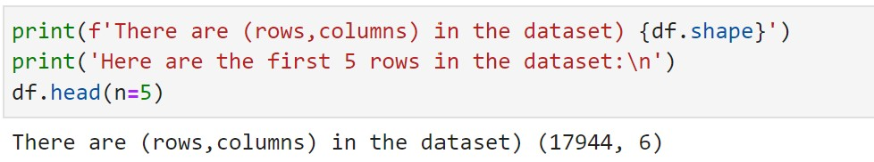
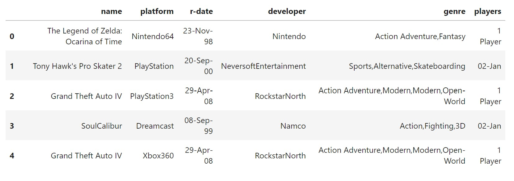

***Figure 0.1 and 0.2 Shape and sample of our dataset***

As you can see above, our dataset is relatively large. It consists of 17944 rows and 6 columns. The 5 rows are the sample of our dataset. In general, all of the dataset have the same format of columns.

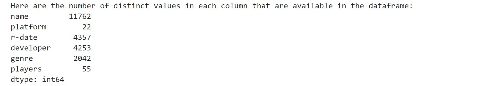

***Figure 0.3 Shape and sample of our dataset***

From above, we can see a bit more in depth of how our data is distributed. Every line represent one column of our dataset, for example, **name** is our first column and it has 11762 distinct values. Which means there are 11762 different games used in our dataset. The rest of the columns are **platform**, **r-date** (release date), **developer**, **genre**, **players** and each corresponding values represent distinct values for each column.

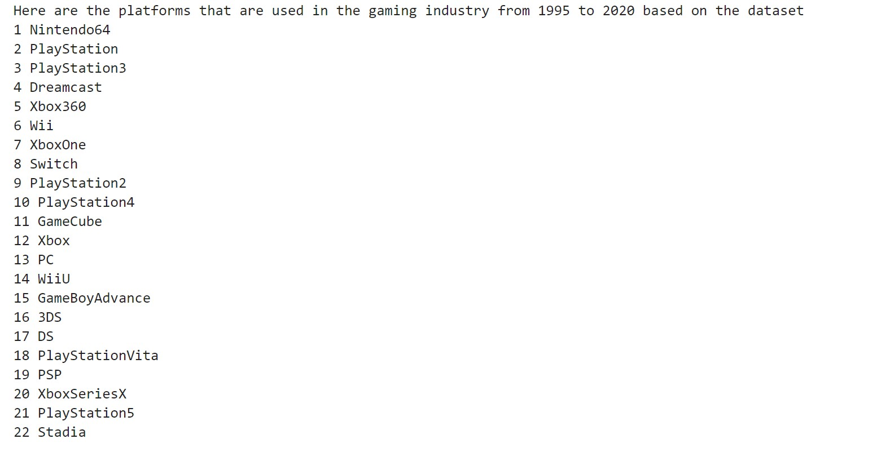

***Figure 0.4 Platform Names***

This is a specific EDA that we did. It shows 22 distinct platform names that is used in **Analysis3** to answer the research question about the trend of gaming platform. 

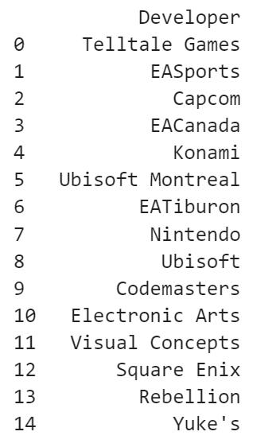

***Figure 0.5 Top 15 Developers***

Another EDA we did was to find out the top 15 developers used for **Analysis2**, in order narrow our scope and choose a developer to investigate the genre trend of.

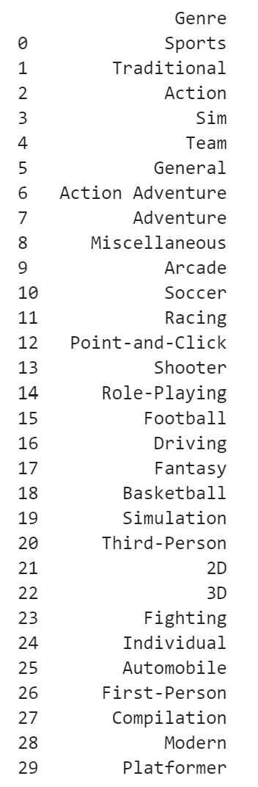

***Figure 0.6 Top 30 Genres***

Now that we've constrained the developers, we were now looking at the top 30 genres created by them, also used for **Analysis2**. This is to ultimately answer the questions about the most popular genre for the developer and the trend of the developer's top genres changing over the years. Note that not all of these genres will necessarily show up in a particular developer's genre distribution, but only genres from this list could show up in a given developer's genre distribution.

### Question 1 + Results

The goal of the first research question was to define the relationship between the genre and the typical number of players each genre allows for. We also explored different areas of this combination including whether or not a certain genre leans towards a certain number of players and if that number is affected by the type of console. All the findings and results can be found in further detail here [analysis1.ipynb](./notebooks/analysis1.ipynb). 

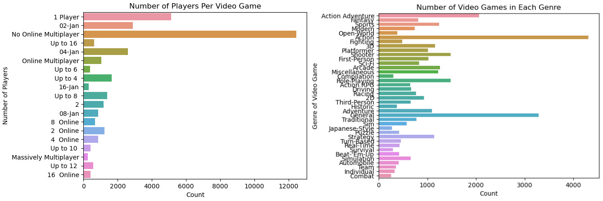

***Figure 1.1 & 1.2 Counts of Genres & Counts of Players***

These are very simple graphs displaying the number of occurrences per genre and the number of occurrences per player amount respectivly. This gives a quick overview of all the most notable attributes and the most popular by count before diving deeping into the analysis. It also allows some inferences and guesses to be made about popular genre mechanics such as the genre Action Adventure having 1 player story based themes.

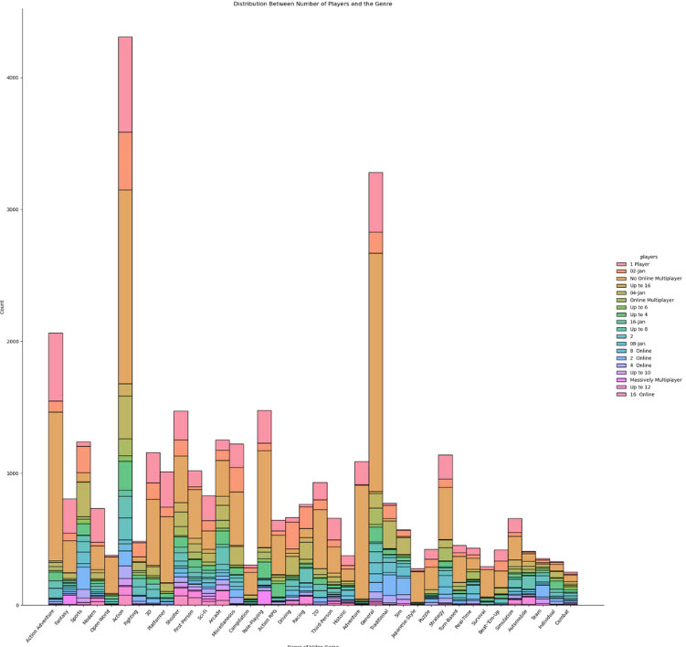

***Figure 1.3 Distribution Between Genre and the Number of Players***

This graph shows the distribution between the genre of game and the platforms they are played on. It gives a visual breakdown per genre and we can see that the genre 'Action' has the most number of games in the dataset. Based on the more specific number of players, we are able to find that 1 player is often offered the most including in the action genre. Looking in general, we can answer our research question by concluding that the most popular genre is 'Action' and tends to lean towards the 'No Multiplayer' or 'Singleplayer' options. This makes sense as actions games often feel like movies and have large story elements implemented. 

If we wanted to further explore the relationship between these two attributes, we can begin to look towards types of consoles and their most popular genres which inexplicitly creates possible varibles of time, dates and technological advancment to consinder. Both Question 2 and Question 3 answer these possibilites.

### Question 2 + Results

The second research question inquired if there is a specific genre that a developer tends to develop video games of, and analyzed, for this developer, whether or not the most developed genre had changed over the years. The results of the data analysis in [analysis2.ipynb](./notebooks/analysis2.ipynb) gave us an insight of the most popular genres for the chosen developer, Nintendo.

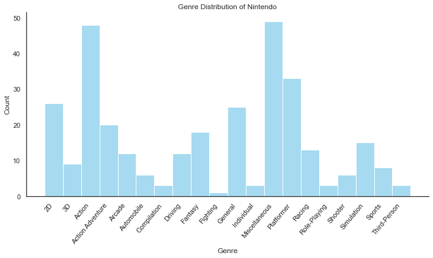

***Figure 2.1 Genre Distribution of Nintendo***

Given the distribution plot of Nintendo's genres in Figure 2.1, it was apparent that their most popular genres were Miscellaneous, Action, and Platformer. Discarding the 2D, Miscellaneous, and General genres due to non-specificity, we analyzed the trend of Nintendo's top five genres: Action, Platformer, Action Adventure, Fantasy, and Simulation.

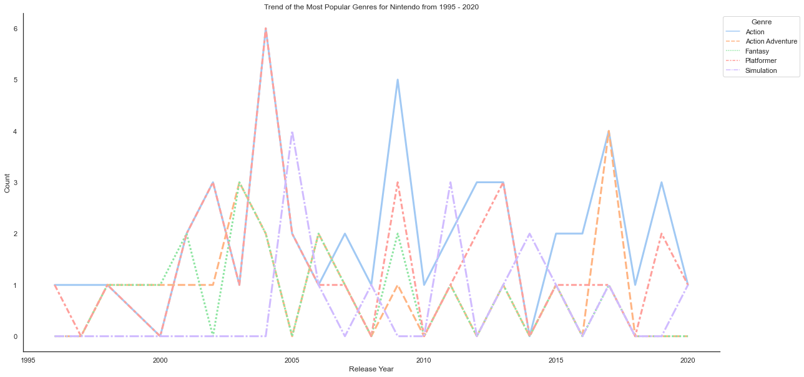

***Figure 2.2 Trend of the Most Popular Genres for Nintendo from 1995 - 2020***

We noticed that while certain genres certainly had more attention than others as a whole, often the most developed genre in a year could differ from the most developed genre in another year, as seen in Figure 2.2. Nintendo's most popular genre overall, Action, was not always the most developed genre from 1995 to 2020. There were years where the action genre was actually less popular than the other genres, such as Simulation games peaking in 2005. We also noticed that a genre could peak in popularity more than once, at different points in time. Not only did the Action genre peak in 2009, but also in 2019, among other years.

This answers our research question, whether there is a specific genre that a developer tends to develop games of, and whether the most developed genre had changed over the years or not. Nintendo tends to develop Action games (after Miscellaneous), and it's genre trend is not stable: the Action genre is not always the most popular in a given year, and different genres will wax and wane in popularity.

### Question 3 + Results
The third research question is to analyze the trend of the gaming platform from 1995 to 2020. With the everchanging nature of technology, video game industries have been changing in terms of the services and subscriptions that they use to develop and offer to the users using the updated tools and technologies in the field. With the rapid growth in the industry, I my research will analyze the shift in the trend of platforms used in the video gaming industry, ranging from the retro-gaming to modernized-gaming consoles overtime from 1995 to 2020. To better understand our process of anlysis and the result, [click this link to better understand our process of anlysis and the resultTo better understand our process of anlysis and the result](./notebooks/analysis3.ipynb)

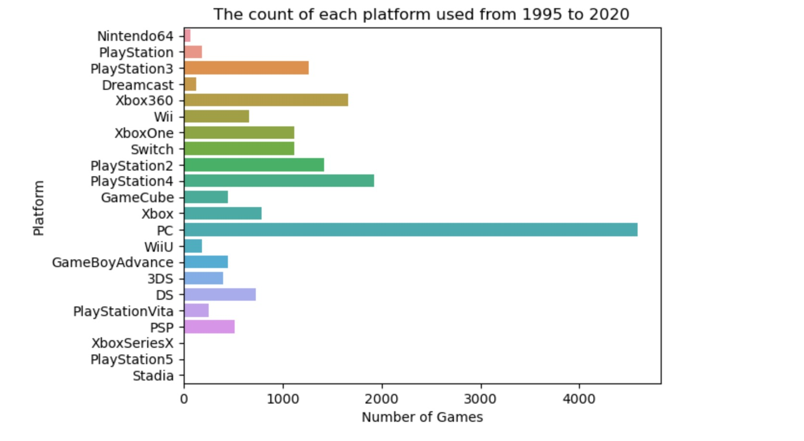

***Figure 3.1 Count of games by Platform***

As we can see in this horizontal bar chart, there are a number of gaming platforms used in the gaming industry. From the dataset itself, we can see that there are 22 different platforms with PC being the most count at around 4000 games. This dataset however, does not tell that PC is the most popular amongst all platform. The dataset is simply a representation from 1995 to 2020. As such, 3 platforms: Stadia, XboxSeriesX and PS5 seem to be the least number, but again, not the least popular since those platforms are released in 2019, 2020 and 2020 respectively. We will see the trend better in the line chart below.

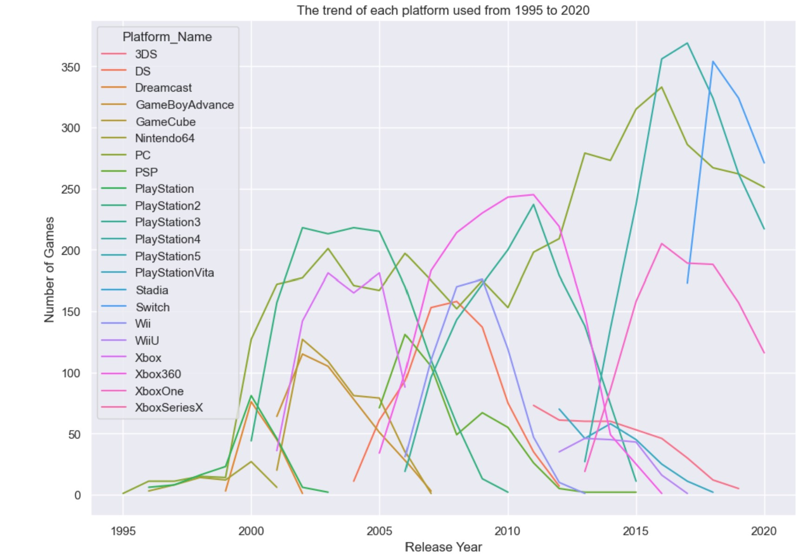

***Figure 3.2 Trend of Gaming Platform by Games***

This overlapped line chart gives a better overview of the trend in each platform from 1995 to 2020. For example, we can see that Gamecube is released in 2021, and overtime, it increases in the number of games until it peaked in around 2002 with around 125 games and started falling and failed to stay in the market in around 2007. Similar to many other platforms such as Dreamcast, 3DS, DS, etc.

PC on the other hand has been very stable. Interestingly however, PC seems to have 0 game in 1995. This can be seen as a anonimity in the dataset, since we know that there are many games that were there in 1995 or even before. This might because, the dataset did not have enough sources to gather games before or in 1995. But most importantly, we can see that PC has been very popular for game developers to create game for. With the rising and falling in between 1995 to 2020, it still remains to have around 250 games by 2020.

Xbox and Playstation have the very interesting trends amongst all others. As we can see, Xbox is first released in 2001 and stopped to have games by 2006, similarly to other series and Playstation series that started at some point, stayed for a while and just lost count of games after a couple years. We do not know for sure the reason behind this, but we can conclude from the chart that once one series end, another new model came out and started gaining popularity for game developers to create game on and the cycle continues. 

We can't conclude what happens in the rise and the drops of gaming platforms just by the chart. But we can tell for sure that the gaming industry was and still is very popular. With the advancing of technology, people are more eager to try on new different platforms that might offer better services than the others, such as better gaming experience.

### Summary
Our findings were a product of our reserach based on the three questions analyzed above. To achieve the most accurate results, we worked with a dataset that included 10 unique columns and over 10,000 rows of data to best represent the trends and patterns. From this we conclude some of the most important findings from our analysis are the following:

<ul>
  <li> Action & 1 Player is the most popular combination between genre and the number of players
  <li> Specifically, Nintendo's top five genres are Action, Platformer, Action Adventure, Fantasy, and Simulation
  <li> Nintendo developed Action games continuously throughout the years, even when Action was not the most popular genre
  <li> There are 22 different platforms with PC having the most entries 
  <li> As expected, the number of games per console increases and decrases as the console's market value rises and falls
</ul>

As shown in the figures above, we were able to create clean visualizations to diplay the data and demonstrate how we were able to answer our intial inquires. Our work only touches the surface of the possible analysis with this dataset, however these results are able to display our processes and the conclusions we were able to make. 
